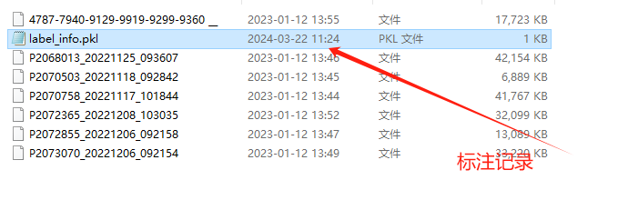

# TEE_labeling

## Introdection

TEE_labeling is a software for professional clinicians to label the classified section of echocardiography. It realizes video playback by parsing DICOM files, and can conveniently record breakpoints and store labeling files.

* label the classified section of echocardiography
<div align="center"></div>
<div align="center"></div>

* annotation result path
<div align="center"></div>

## Environment
```
pip install pyqt
pip install loguru
pip install SimpleITK
pip install opencv-python
```
## Install
* clone the project by ```git clone git@github.com:auquenton/TEE_labeling.git```
* ```cd TEE_labeling```
* change ```[x2, y2, x1, y1]``` in ```TEE-label/DicomCapture.py``` to adjust ROI.
* ```python MainThread.py```
